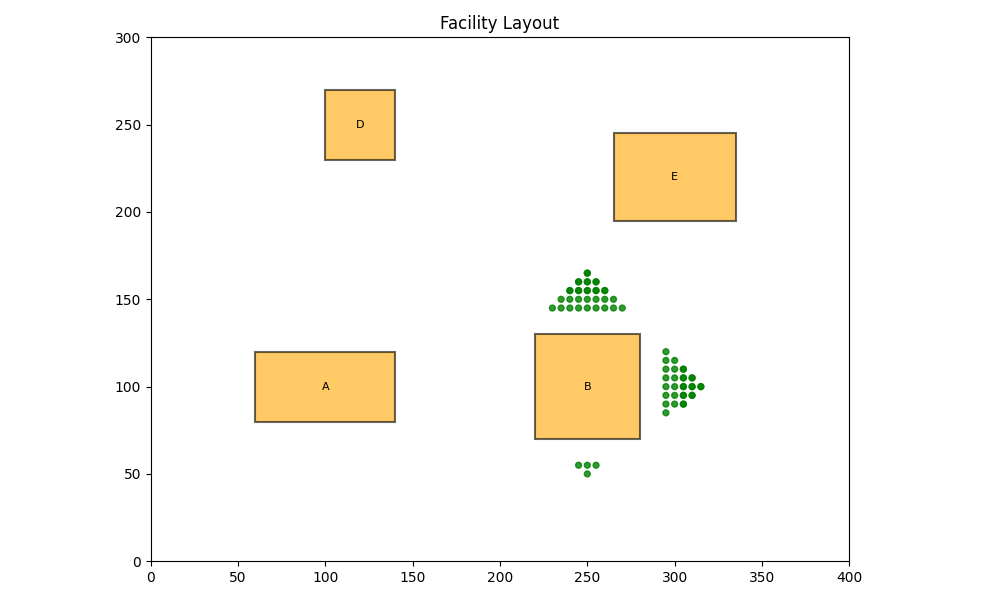
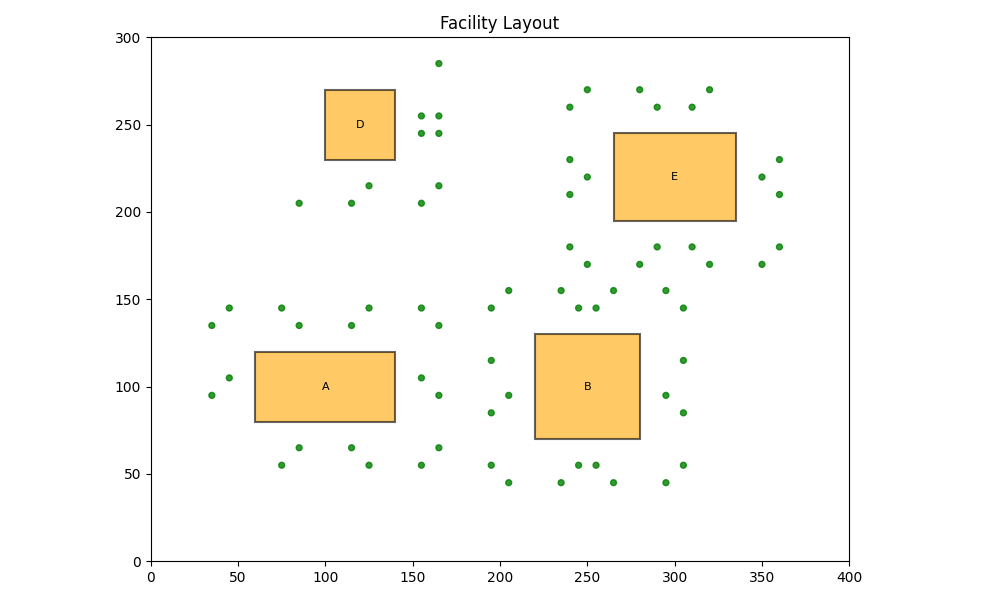
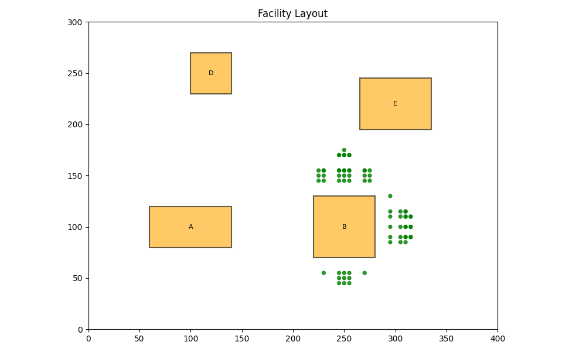
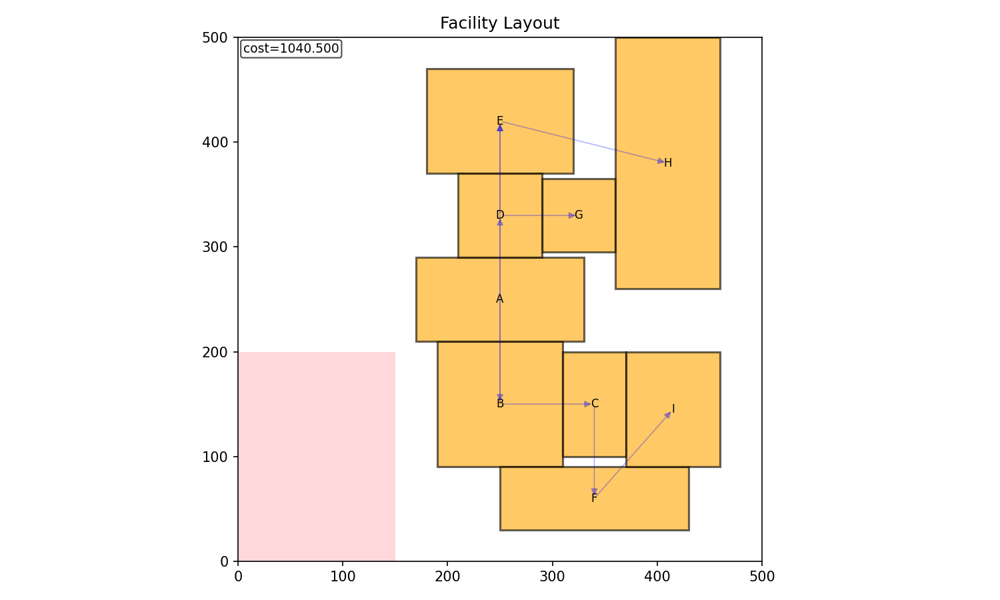
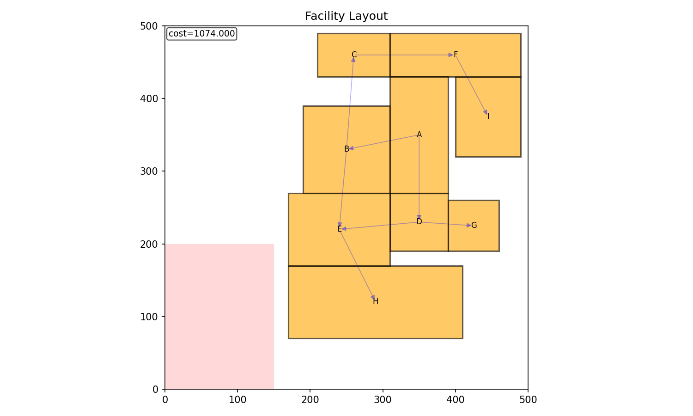
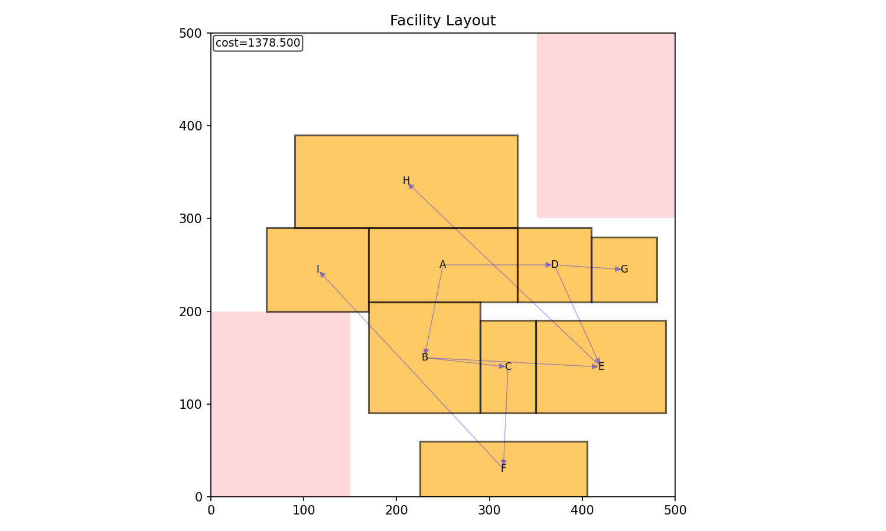
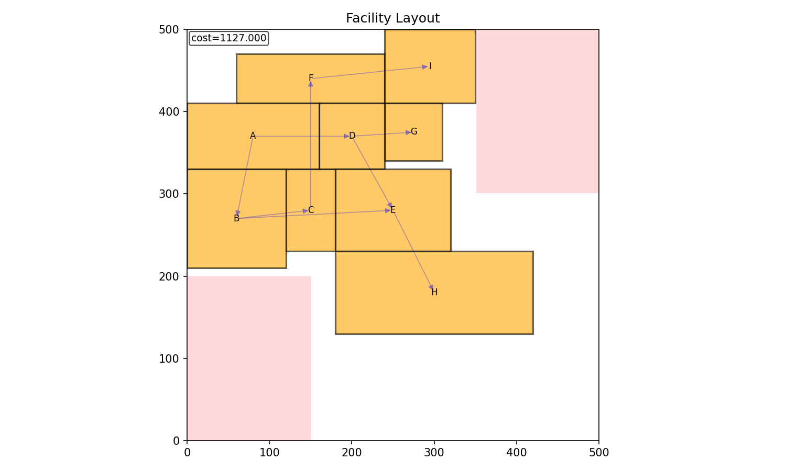

# 개요

기존 초기배치는 그리디한 로컬 탐색에 기반해, 매 단계에서 현재까지 배치된 설비들을 기준으로 가장 좋아 보이는 위치를 즉시 확정합니다. 이 방식은 구현이 단순하고 빠르게 feasible한 초기해를 얻을 수 있다는 장점이 있지만, 뒤에 배치될 설비를 위해 공간을 의도적으로 비워두거나, 향후 충돌 가능성을 미리 고려해 우회 배치를 선택하는 등 전역적인 관점의 의사결정이 어렵습니다. 그 결과, 공정 전체 효율을 최적화하기보다는 국소 최적에 머무르거나, 좁은 공간에서 후속 설비 배치가 막히는 문제가 발생할 수 있었습니다. 이러한 한계를 극복하기 위해 전역 최적 관점에서 장기 보상을 고려할 수 있는 강화학습 기반 접근을 시도했습니다.

그러나 강화학습 역시 공장 배치 문제에서서 구조적 난점이 있습니다. 우선 공장 크기가 500×500, 1000×1000(또는 그 이상)으로 커질수록 상태 표현과 행동 선택의 후보가 기하급수적으로 증가하여 action space 및 observation space가 매우 커집니다. 또한 weight, dry 등 다양한 제약 조건이 동시에 적용되면서 실제로 선택 가능한 유효 행동의 비율이 낮아지고, 탐색 과정에서 제약 위반이 빈번하게 발생합니다. 이로 인해 보상 신호가 패널티 중심으로 왜곡되거나 학습 변동성이 커져, 정책이 안정적으로 수렴하기 어렵다는 문제가 있었습니다.

# Top-K sampling 기반 접근 

## 목적

모든 좌표를 agent가 직접 선택하지 않도록 하고, 환경이 가능성이 높은 후보를 미리 추려 Top-K 후보 집합으로 제공합니다. 이렇게 하면 불필요한 탐색을 줄이고 agent가 유효한 행동만을 선택할 수 있게 됩니다. 

이때 탐색과 활용의 균형을 맞추는 것이 중요합니다. 초기부터 유망한 지점만 반복적으로 제안하면 후보가 특정 패턴에 고착되어 더 좋은 배치를 발견하기 어렵고, 반대로 무작정 넓게만 탐색하면 거대한 격자 공간에서 학습 효율이 급격히 떨어집니다. 따라서 Top-K 후보 생성 단계에서 점수 기반 샘플링으로 개선 가능성이 큰 후보를 확보하고, 경계 기반 샘플링으로 배치 문제에서 자주 유효한 접촉 위치들을 집중적으로 포함하며, 무작위 기반 샘플링으로 미탐색 영역을 지속적으로 커버해 다양성을 유지하는 방식으로 탐색-활용 트레이드오프를 안정적으로 구성합니다.

## 샘플링 방식 

### 점수 기반 샘플링
현재 상태에서 목적함수 값이 가장 많이 개선될 것으로 예상되는 위치들을 빠르게 평가하고, 개선 폭이 큰 후보부터 우선적으로 선택합니다. 이렇게 하면 학습 초기에 유효한 후보를 안정적으로 확보할 수 있고, 거대한 격자 공간을 무차별적으로 탐색하지 않아도 됩니다.

### 경계 기반 샘플링
이미 배치된 설비나 구역 마스크의 경계에 새 설비가 맞닿는 위치들을 후보로 생성합니다. 예를 들어 코너-코너 또는 엣지-엣지 형태로 정렬되는 좌표들을 만들고, 겹침 및 제약 검사를 통과한 후보만 남깁니다. 배치 문제에서는 공간을 압축하는 좋은 배치가 경계 접촉 형태로 자주 나타나므로, 적은 수의 후보만으로도 품질 높은 선택지를 얻을 수 있습니다.

### 무작위 기반 샘플링
배치 가능한 영역에서 좌표를 무작위로 뽑고, 제약과 겹침 검사를 통과한 후보만 후보 집합에 포함합니다. 점수 기반이나 경계 기반 방식이 특정 영역이나 패턴에 치우칠 수 있기 때문에, 무작위 샘플링을 섞어 후보 다양성을 확보하고 지역 최적(local minima)에 고착되는 현상을 줄입니다.

### 중복 제거 
후보 생성 과정에서는 중복 제거 단계도 함께 포함합니다. 후보가 특정 영역에 몰리면 agent가 제한된 패턴만 반복적으로 보게 되어 선택이 편향될 가능성이 커지고, 서로 매우 가까운 좌표들은 실제 배치 효과가 거의 동일한데도 후보 리스트를 불필요하게 소모하게 됩니다. 이를 줄이기 위해 좌표를 일정 해상도 q로 양자화해 유사한 후보를 같은 버킷으로 묶고, 동일 버킷에 속한 후보는 하나만 남깁니다. 구체적으로 후보의 (x, y)를 qx = round(x / q), qy = round(y / q)로 변환하고, 회전과 형태 정보까지 포함해 (qx, qy, rot, shape_id)를 키로 구성한 뒤 동일 키를 갖는 후보를 제거합니다. 이 방식은 후보 다양성을 확보하면서도 후보 집합 크기를 안정적으로 유지할 수 있고, 이후 더 정밀한 탐색이 필요하면 q를 줄이거나 최종 선택 후보 주변에서 별도의 미세 조정 단계를 추가하는 방식으로 확장할 수 있습니다.

| q=5 | q=10 |
|---|---|
|  |  |

### 최종

이 세 가지 샘플링 방식의 비율은 파라미터로 조정 가능하며, 최종적으로 구성되는 Top-K 후보 집합의 예시는 다음과 같습니다.

# Greedy + Search 실험

위에서 말한 Top-K 샘플링에 greedy policy를 통해 결과가 얼마나 잘 나오는지 확인하였습니다. Greedy란 딱 한 수 앞만을 고려해서 비용을 가장 크게 줄이는 행동을 선택하는 정책을 의미합니다. 다만 greedy policy만을 적용하면 local minima에 빠지기 쉬워 물류와 같은 설비 간 관계를 충분히 고려하기 어렵고, 특히 좁은 공간에 배치해야 하는 경우 이후 배치 가능성을 남겨두지 못해 배치가 실패하는 상황도 발생할 수 있습니다.

따라서 본 실험에서는 greedy에 탐색 알고리즘을 결합했을 때 실제 성능 개선으로 이어지는지 확인해보았습니다. Greedy 단독과 greedy + search의 성능을 비교하였고, search 알고리즘으로는 MCTS와 Beam Search를 사용하였습니다.

MCTS는 현재 상태에서 가능한 행동들을 트리 형태로 확장하면서 다수의 시뮬레이션을 통해 각 행동의 장기적인 기대 성능을 추정하는 탐색 기법입니다. 여러 단계 이후의 결과까지 반영할 수 있어, 초반 선택이 이후 배치 가능성을 크게 좌우하는 복잡한 문제에서 배치 안정성을 높이는 데 유리합니다. 다만 계산 비용이 크고, 시뮬레이션 수나 깊이가 충분하지 않으면 추정이 불안정해져 최선의 해를 찾지 못하거나 오히려 greedy보다 성능이 떨어질 수 있습니다. 대신 배치 실패가 자주 발생하는 복잡한 문제에서 안정적으로 배치를 완성하는 방향으로 탐색이 유도되는 경향이 있습니다.

Beam Search는 각 단계에서 가능한 후보 중 상위 몇 개만 유지한 채 다음 단계로 확장하는 제한 탐색 방식입니다. 유망한 후보를 여러 개 유지하며 진행하기 때문에 한 번의 선택 실수로 이후에 배치가 막히는 상황을 일부 완화할 수 있습니다. 또한 MCTS처럼 많은 시뮬레이션을 수행하지 않기 때문에 계산 비용이 상대적으로 작고, greedy와 유사한 구조라 구현 및 튜닝 부담도 비교적 낮습니다. 다만 현재 점수 기준으로 상위 후보 중심 탐색을 진행하므로 장기적으로는 유리하지만 당장 점수가 낮은 경로를 일찍 버릴 수 있고, 결과적으로 best 위주로 편향되면 greedy와 큰 차이를 만들지 못할 가능성이 있습니다.

제약조건이 많지 않은 쉬운 문제의 경우 greedy와 greedy + MCTS 모두 비슷한 성능을 보여주었습니다.

| Greedy (cost = 1040.5) | Greedy + MCTS (cost = 1074.5) | Greedy + Beam Search (cost = 1066.0) |
|---|---|---|
|  |  |  |

하지만 어려운 문제에서는 greedy + MCTS의 점수가 크게 앞서는 경우가 많았고, 다른 알고리즘이 배치에 실패한 상황에서도 배치에 성공하는 사례를 확인할 수 있었습니다.

| Greedy (cost = 1378.5) | Greedy + MCTS (cost = 1127.0) | Greedy + Beam Search (cost = 1272) |
|---|---|---|
|  |  |  |

| Greedy (배치실패) | Greedy + MCTS (cost = 1329.0) | Greedy + Beam Search (배치실패) |
|---|---|---|
|  |  |  |

# 보상 재설계

보상 값의 절대 크기가 과도하게 커지는 경우 MCTS의 백업 과정에서 값의 분산이 커져 탐색이 불안정해지고, 이후 강화학습 학습 과정에서도 그래디언트 스케일이 흔들리며 수렴이 불안정해지는 문제가 있었습니다. 이에 따라 보상이 일정 범위 내에서 동작하도록 스케일링을 적용하였고, 보상 값이 대략적으로 -5에서 5 범위로 들어오도록 scale factor를 추가하였습니다. 구현은 보상 함수를 100으로 나누는 방식으로 정규화하였습니다.

또한 장애물이 많아지거나 배치 가능한 공간이 감소할수록 MCTS가 수렴하지 못하는 문제가 관찰되었습니다. 원인을 분석한 결과, 현재 설비 배치에 성공한 경우 음수 보상을 받고 실패한 경우 0 보상을 받는 구조로 인해, 에이전트가 실패를 더 유리한 결과로 해석하는 역전 현상이 발생하고 있었습니다. 이에 따라 배치 실패 시에는 명시적으로 페널티를 부여하도록 보상 함수를 수정하였고, 더 이상 유효한 배치가 존재하지 않아 배치를 진행할 수 없는 상황에서는 아직 배치하지 못한 설비들의 면적 합에 비례하는 추가 페널티를 부여하도록 보상 함수를 재설계하였습니다.

$$
r_{\text{terminal}}
= -\lambda \cdot 
\frac{\sum_{g \in \text{remaining}} \left(w_g h_g\right)}
{\sum_{g \in \text{all}} \left(w_g h_g\right)}
$$

다만 배치 실패에 대한 페널티가 과도하게 커질 경우, 에이전트가 실패 가능성이 있는 구조 자체를 과도하게 회피하여 탐색이 보수적으로 변하고, 결과적으로 더 나은 배치를 발견할 수 있는 모험적 시도를 위축시킬 수 있다는 한계가 있습니다. 따라서 페널티 크기와 잔여 면적 페널티의 비율은 추가 실험을 통해 안정성과 탐색 성능의 균형이 맞는 구간을 탐색하며 조정해 나갈 계획입니다.

# Alphachip 

구글 딥마인드에서 2021년에 개발한 AlphaChip을 본 프로젝트에 맞게 구현해보았습니다. AlphaChip은 칩 설계에서 연결 관계를 나타내는 그래프 구조와 평면 배치 제약을 동시에 고려하고, 배치 과정을 순차적 의사결정 문제로 재구성해 강화학습으로 최적 해를 탐색하는 접근으로 알려져 있습니다.

AlphaChip은 컴포넌트를 하나씩 배치해 나가는 순차적으로 배치하는데, 이떄 강화학습 에이전트는 현재까지의 배치 상태를 관측으로 받아 이미 배치된 요소와 남은 요소, 요소 간 연결 관계, 혼잡도와 거리 신호 등을 종합적으로 반영하고, 다음에 배치할 요소의 위치를 선택하는 정책을 학습합니다.

공장 설비 배치 문제는 반도체 플로어플래닝과 구조적으로 유사한 점이 많다고 판단하였습니다. 칩 설계에서 매크로 간 연결이 배치 품질에 큰 영향을 주는 것처럼, 공장 배치에서도 설비 간 물류 흐름과 다양한 제약 조건이 최종 배치 품질에 직접적으로 작용합니다. 따라서 그래프 기반의 관계와 2차원 평면 배치를 함께 다루는 AlphaChip의 문제 설정과 최적화 방식은 본 프로젝트에도 충분히 이식 가능하다고 보았습니다.

다만 구글 딥마인드에서 공개한 공식 오픈소스 (https://github.com/google-research/circuit_training)는 TensorFlow와 TPU 기반으로 구성되어 있어 범용적인 환경에서 활용하거나 다른 모델 및 파이프라인과 결합하는 데 제약이 있었습니다. 이에 따라 공개 구현을 참고하되, 실행 환경과 확장성을 고려하여 PyTorch와 GPU 기반 코드로 전면 리팩토링을 진행하였습니다.

또한 리팩토링한 구현을 기존에 사용하던 공장 배치 환경과 연동하여, 학습과 평가가 동일한 인터페이스에서 동작하도록 통합하였습니다. 이 과정에서 AlphaChip에서 활용된 범용적인 아이디어 중 하나인 배치 순서를 큰 설비부터 우선 배치하는 전략이 공장 배치뿐 아니라 다른 최적화 모델에도 적용 가능하다고 판단하였고, 이를 환경 코드의 기본 정책으로 반영하였습니다. 추가로 면적이 동일한 설비가 존재하는 경우에는 그래프 연결 구조를 기준으로 우선순위를 결정하도록 하여, 물류 흐름과 연관성이 큰 설비가 먼저 배치되도록 정렬 규칙을 구성하였습니다.

