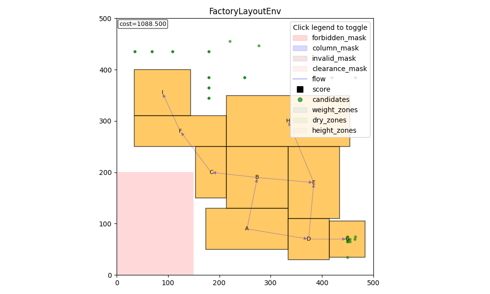

## 개요

기존 초기배치는 그리디한 로컬 탐색에 기반해, 매 단계에서 현재까지 배치된 설비들을 기준으로 가장 좋아 보이는 위치를 즉시 확정합니다. 이 방식은 구현이 단순하고 빠르게 feasible한 초기해를 얻을 수 있다는 장점이 있지만, 뒤에 배치될 설비를 위해 공간을 의도적으로 비워두거나, 향후 충돌 가능성을 미리 고려해 우회 배치를 선택하는 등 전역적인 관점의 의사결정이 어렵습니다. 그 결과, 공정 전체 효율을 최적화하기보다는 국소 최적에 머무르거나, 좁은 공간에서 후속 설비 배치가 막히는 문제가 발생할 수 있었습니다. 이러한 한계를 극복하기 위해 전역 최적 관점에서 장기 보상을 고려할 수 있는 강화학습 기반 접근을 시도했습니다.

그러나 강화학습 역시 공장 배치 문제에서서 구조적 난점이 있습니다. 우선 공장 크기가 500×500, 1000×1000(또는 그 이상)으로 커질수록 상태 표현과 행동 선택의 후보가 기하급수적으로 증가하여 action space 및 observation space가 매우 커집니다. 또한 weight, dry 등 다양한 제약 조건이 동시에 적용되면서 실제로 선택 가능한 유효 행동의 비율이 낮아지고, 탐색 과정에서 제약 위반이 빈번하게 발생합니다. 이로 인해 보상 신호가 패널티 중심으로 왜곡되거나 학습 변동성이 커져, 정책이 안정적으로 수렴하기 어렵다는 문제가 있었습니다.

## Top-K sampling 기반 접근 

### 목적

모든 좌표를 agent가 직접 선택하지 않도록 하고, 환경이 가능성이 높은 후보를 미리 추려 Top-K 후보 집합으로 제공합니다. 이렇게 하면 불필요한 탐색을 줄이고 agent가 유효한 행동만을 선택할 수 있게 됩니다. 

이때 탐색과 활용의 균형을 맞추는 것이 중요합니다. 초기부터 유망한 지점만 반복적으로 제안하면 후보가 특정 패턴에 고착되어 더 좋은 배치를 발견하기 어렵고, 반대로 무작정 넓게만 탐색하면 거대한 격자 공간에서 학습 효율이 급격히 떨어집니다. 따라서 Top-K 후보 생성 단계에서 점수 기반 샘플링으로 개선 가능성이 큰 후보를 확보하고, 경계 기반 샘플링으로 배치 문제에서 자주 유효한 접촉 위치들을 집중적으로 포함하며, 무작위 기반 샘플링으로 미탐색 영역을 지속적으로 커버해 다양성을 유지하는 방식으로 탐색-활용 트레이드오프를 안정적으로 구성합니다.

### 점수 기반 샘플링
현재 상태에서 목적함수 값이 가장 많이 개선될 것으로 예상되는 위치들을 빠르게 평가하고, 개선 폭이 큰 후보부터 우선적으로 선택합니다. 이렇게 하면 학습 초기에 유효한 후보를 안정적으로 확보할 수 있고, 거대한 격자 공간을 무차별적으로 탐색하지 않아도 됩니다.

### 경계 기반 샘플링
이미 배치된 설비나 구역 마스크의 경계에 새 설비가 맞닿는 위치들을 후보로 생성합니다. 예를 들어 코너-코너 또는 엣지-엣지 형태로 정렬되는 좌표들을 만들고, 겹침 및 제약 검사를 통과한 후보만 남깁니다. 배치 문제에서는 공간을 압축하는 좋은 배치가 경계 접촉 형태로 자주 나타나므로, 적은 수의 후보만으로도 품질 높은 선택지를 얻을 수 있습니다.

### 무작위 기반 샘플링
배치 가능한 영역에서 좌표를 무작위로 뽑고, 제약과 겹침 검사를 통과한 후보만 후보 집합에 포함합니다. 점수 기반이나 경계 기반 방식이 특정 영역이나 패턴에 치우칠 수 있기 때문에, 무작위 샘플링을 섞어 후보 다양성을 확보하고 지역 최적(local minima)에 고착되는 현상을 줄입니다.

### 중복 제거 
후보 생성 과정에서는 중복 제거 단계도 함께 포함합니다. 후보가 특정 영역에 몰리면 agent가 제한된 패턴만 반복적으로 보게 되어 선택이 편향될 가능성이 커지고, 서로 매우 가까운 좌표들은 실제 배치 효과가 거의 동일한데도 후보 리스트를 불필요하게 소모하게 됩니다. 이를 줄이기 위해 좌표를 일정 해상도 q로 양자화해 유사한 후보를 같은 버킷으로 묶고, 동일 버킷에 속한 후보는 하나만 남깁니다. 구체적으로 후보의 (x, y)를 qx = round(x / q), qy = round(y / q)로 변환하고, 회전과 형태 정보까지 포함해 (qx, qy, rot, shape_id)를 키로 구성한 뒤 동일 키를 갖는 후보를 제거합니다. 이 방식은 후보 다양성을 확보하면서도 후보 집합 크기를 안정적으로 유지할 수 있고, 이후 더 정밀한 탐색이 필요하면 q를 줄이거나 최종 선택 후보 주변에서 별도의 미세 조정 단계를 추가하는 방식으로 확장할 수 있습니다.

| q=5 | q=10 |
|---|---|
|  |  |

### 최종

이 세 가지 샘플링 방식의 비율은 파라미터로 조정 가능하며, 최종적으로 구성되는 Top-K 후보 집합의 예시는 다음과 같습니다.

