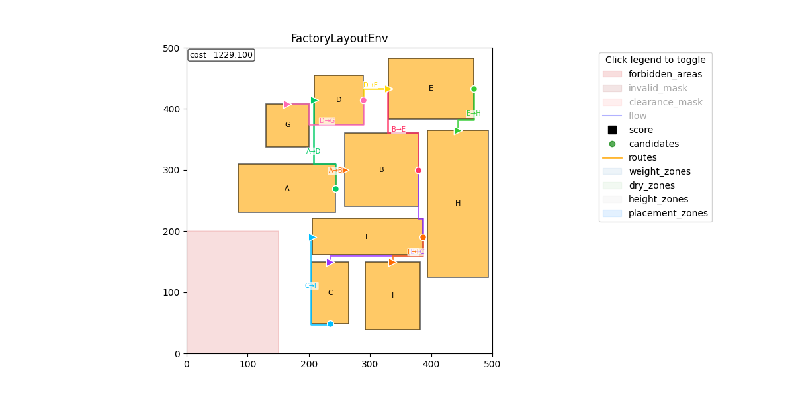
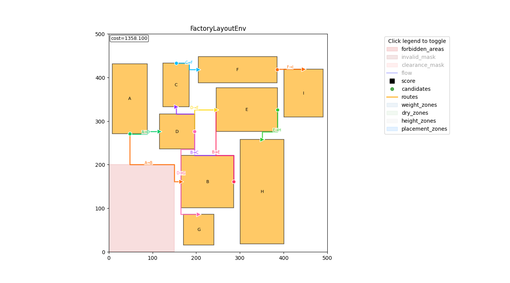

placable area 추가

### 실 데이터 호환 코드 생성성

### pathfinding 알고리즘 추가

배치 완료 후 설비 간 물류 동선을 다익스트라(Dijkstra) 알고리즘으로 계산합니다. 경로는 clearance 영역은 통과할 수 있지만, 설비 본체와 금지 영역은 회피하도록 설정했습니다. 다익스트라는 병렬화가 어렵고 계산 비용이 높기 때문에 매 step마다 호출하지 않고, episode 종료 후 한 번만 수행합니다.

또한 회전 후보를 확장했습니다. 0°/180°, 90°/270°는 설비 외형은 동일하고 입·출구 위치만 달라지는 케이스이므로, 기존에는 0°/90°만 후보로 생성하던 방식에서 180°/270°도 함께 평가하도록 변경했습니다. 점수 계산은 L1(맨해튼) 거리 기반이라 계산이 단순하고 선형적이어서, 여러 회전 후보의 점수를 병렬로 계산한 뒤 최적 회전을 선택할 수 있습니다.

| 180°/270° 회전 미지원                              | 180°/270° 회전 지원                             |
| --------------------------------------------- | ------------------------------------------- |
|  |  |

실험 결과, 180°/270° 회전 후보를 추가해도 전체 결과에는 큰 차이가 없었습니다. 이번 조건에서는 180°/270° 회전이 불가능하더라도 기존 알고리즘이 배치를 안정적으로 완료했고, 물류 동선 관점에서도 충분히 좋은 해를 찾는 것을 확인했습니다.

다만, 입출구 방향이 경로의 존재 가능성 또는 동선 비용에 크게 영향을 주는 문제에서는 180°/270° 미지원이 병목이 될 수 있습니다. 예를 들어 통로가 편향되어 특정 방향 접근이 사실상 강제되는 경우에는, 0°/90°만 허용하면 유효 경로가 크게 돌아가거나 특정 설비 쌍의 동선 비용이 과도하게 커질 수 있습니다. 따라서 해당 기능은 토글 옵션으로 유지하여, 케이스에 따라 활성화해 성능 저하 원인을 분리하고 필요 시 개선할 수 있도록 했습니다.